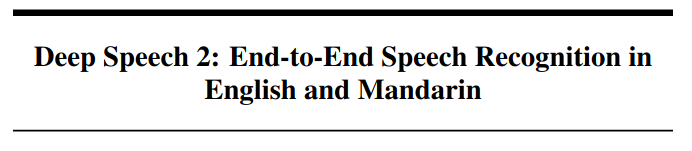
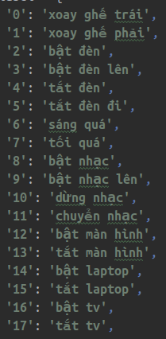
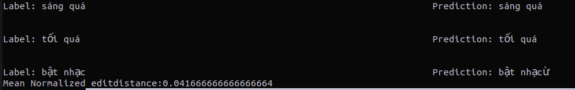
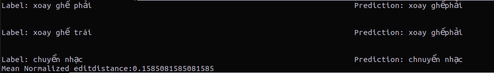
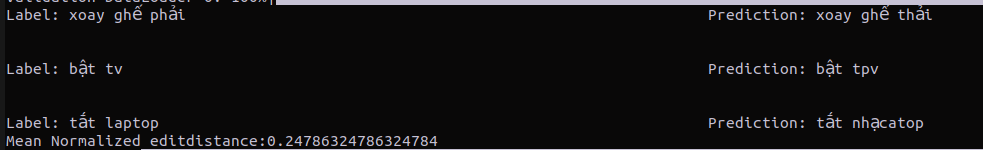
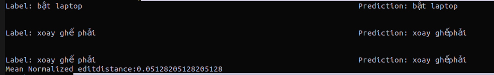

# Customized Speech Recognition model for Command Recognition

## Motivation

This project was developed for my Speech Processing course in my University. The model architecture was inspired
by [DeepSpeech2](https://arxiv.org/pdf/1512.02595.pdf)'s architecture.
 <p align="center"></p>

## Requirements

I highly recommend using conda virtual environment. I implemented this model with Pytorch and Pytorch Lightning.

```bash
pip install -r requirements.txt
```

## Dataset

The dataset used for training and evaluating this model was reccored and cleaned by me and my teamates. It contains 3800
wav files of 18 commands below:
<p align="center"></p>

## Training

 ```bash
 python train.py --epoch [num of epochs] --batch_size [batchsize] --data [path to image directory]  --vocab [path to vocab model file] --mode [decode mode: 'greedy' or 'beam'] 
 ```

## Decoding
I used [CTC](https://towardsdatascience.com/intuitively-understanding-connectionist-temporal-classification-3797e43a86c) as loss function. There are two strategies for decoding task, [Greedy or BeamSearch](https://d2l.ai/chapter_recurrent-modern/beam-search.html) decoder.

## Inference
<p align="center"></p>
<p align="center"></p>
<p align="center"></p>
<p align="center"></p>

